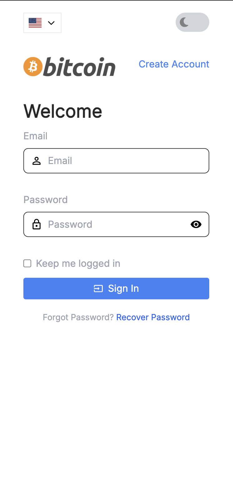

<p align="center">
  <h1 align="center">Gerenciador de Ativos</h1>
  <div align="center">
   <table>
      <tr>
         <td>Desktop</td>
         <td>Mobile</td>
      </tr>
      <tr>
         <td>
            
         </td>
         <td>
            
         </td>
      </tr>
   </table>
  </div>
</p>

## 🌐 Demonstração


## 📘 Sobre o Projeto

Este projeto é uma aplicação web de login responsivo, desenvolvido com React Js e TypeScript. "CryptoData Viewer" é uma interface web que interage com a API do "CryptoData Suite", focada em exibir de maneira organizada os nomes das criptomoedas. Ao selecionar um nome de moeda, um modal é apresentado, detalhando informações como ranking, preço e mais, tudo isso obtido dinamicamente via AJAX para uma experiência de usuário fluída e informativa. Inclui também um CRUD para gerenciar grupos de moedas favoritas, permitindo visualizar as moedas de um grupo específico em um modal e oferecendo a opção de remover moedas desse grupo conforme necessário.

# 📚 Funcionalidades

- [x] Login com autenticação integrado com API, o repósitorio da API pode ser encontrado [aqui](https://github.com/billyfranklim1/coins-manager-web)
- [x] Responsividade
- [x] Internacionalização (i18n) com suporte a inglês, português, espanhol e francês
- [x] Dark Mode
- [x] Toasts de notificação
- [x] Animações
- [x] Login
- [x] Cadastro
- [x] CRUD de grupos
- [x] Lista de moedas e as cotações de cada uma

## 💻 Tecnologias e Bibliotecas

Este projeto foi desenvolvido utilizando-se das seguintes tecnologias e bibliotecas:

- TypeScript
- React Js
- Vite
- React Query
- React Toastify
- React I18next
- Framer Motion

## 🚧 Pré-requisitos

Para rodar este projeto, você precisará de:

- Node.js (versão 14.0 ou superior)
- Git
- npm (ou yarn, se preferir)

## 🛠️ Instalação

Siga estes passos para configurar o projeto localmente:

1. **Clonar o Repositório:**

   ```bash
   git clone https://github.com/billyfranklim1/coins-manager-web.git
   cd coins-manager-web
   ```

2. **Instalar Dependências:**

   ```bash
   npm install
   ```

3. **Configurar Variáveis de Ambiente:**
   Renomeie o arquivo `.env.example` para `.env` e ajuste as variáveis conforme necessário.

   ```bash
   NEXT_PUBLIC_API_URL=url-da-api
   ```

4. **Iniciar o Projeto:**
   ```bash
   npm run dev
   ```

## 🤝 Como Contribuir

Sua contribuição é bem-vinda! Se você tiver sugestões para melhorar este projeto, sinta-se à vontade para fazer um fork do repositório, realizar as mudanças e criar um pull request. Seu feedback é muito valioso.

## 📜 Licença

Este projeto está sob licença MIT. Veja o arquivo [LICENSE](LICENSE) para mais detalhes.

<p align="center">Desenvolvido tomando ☕ por Billyfranklim 🚀</p>
